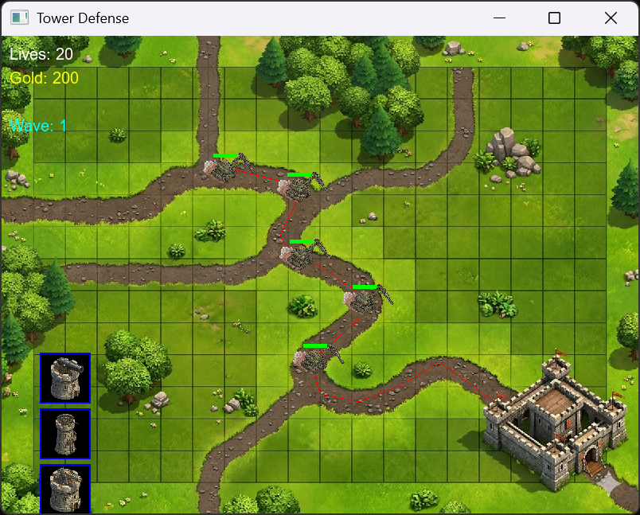
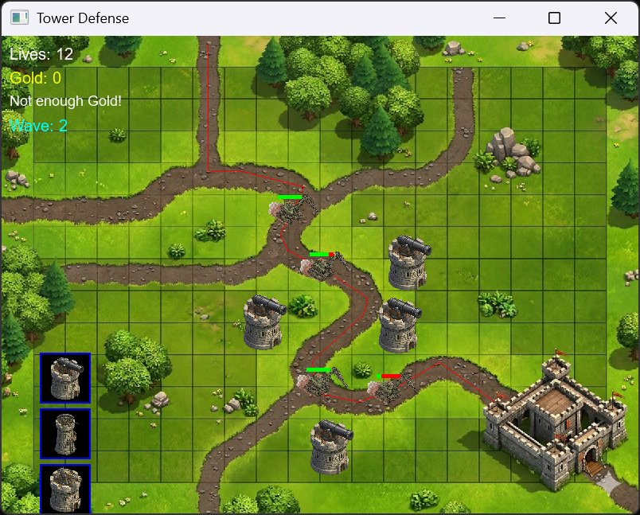
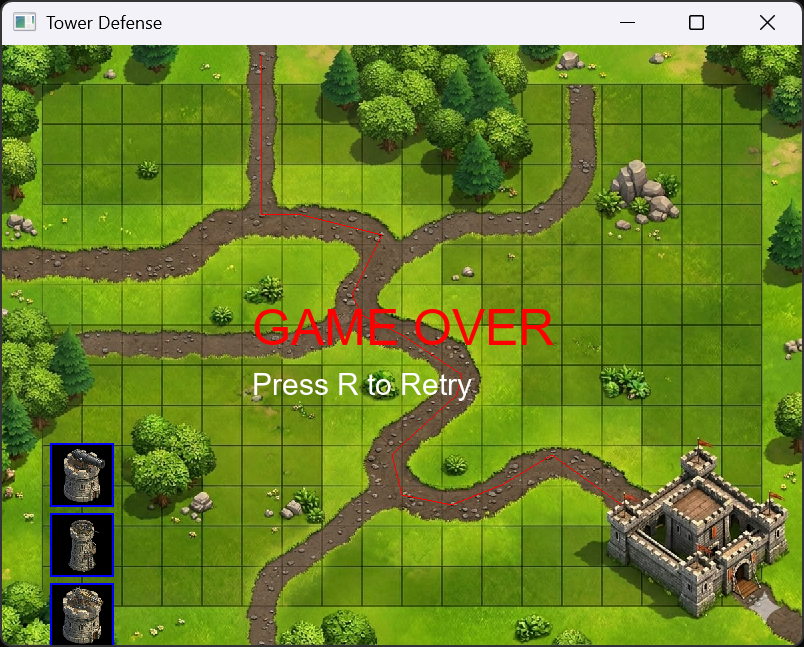

# Tower-Defense
The project implements a simple C++ based Tower Defense simulator. The project uses the concepts of Object Oriented Programming . The project is created with SFML 3.1. Concepts of memory leakages, pointers, classes, operator overloading can be seen frequently used in the coding of this program.  
# Tower Defense Game (C++ / SFML)
A 2D Tower Defense game developed in **C++** using the **SFML** graphics library.
The project demonstrates the use of **Object-Oriented Programming (OOP)** concepts including inheritance, polymorphism, abstraction, encapsulation, dynamic memory management, and operator overloading.
# Features
## Core Gameplay
* Playable tower defense map with a visible enemy path
* Multiple enemy types with different behaviors
* Multiple tower types with unique attack mechanics
* Progressive enemy wave system
* Gold/economy system
* Tower placement using mouse input
* Lives/health system
* Win and Game Over screens
* Enemy HP bars
* Real-time HUD displaying:
  * Current wave
  * Gold
  * Remaining lives
---
# Enemy Types
### Fast Enemy
* High movement speed
* Low HP
### Tank Enemy
* Slow movement
* High HP
### Normal Enemy
* Balanced stats
---
# Tower Types
### Cannon Tower
* Moderate range
* Splash-style attack
### Sniper Tower
* Long range
* High damage
### Machine Tower
* Rapid fire rate
* Lower damage per shot
---
# OOP Concepts Used
## Abstraction
Abstract base classes:
* `Enemy`
* `Tower`
using pure virtual functions.
---
## Inheritance
All enemy and tower types inherit from their respective base classes.
Example:
```cpp
class FastEnemy : public Enemy
class SniperTower : public Tower
```
---
## Runtime Polymorphism
Enemies and towers are handled using base-class pointers.
Example:

```cpp
Enemy** enemies;
Tower** towers;
```
---
## Encapsulation
Private/protected data members are used with controlled access through member functions.
---
## Operator Overloading
Custom operator overloading has been implemented within the project.
---
## Dynamic Memory Management
Dynamic arrays and pointers are used instead of STL vectors.
All allocated memory is properly released to avoid memory leaks.
---
# Technologies Used
* C++
* SFML (Simple and Fast Multimedia Library)
---
# Requirements
Before running the project, install:
* C++ Compiler
* SFML Library
---
# How to Run
## 1. Clone Repository
```bash
git clone https://github.com/Aaliyan-Aziz/Tower-Defense/blob/main/README.md
```
---
## 2. Open Project
Open the project in:
* Visual Studio
* VS Code
* Code::Blocks
* Any C++ IDE with SFML support
---
## 3. Configure SFML
Link SFML include and library files properly.
Required SFML modules:
* graphics
* window
* system
* audio
---
## 4. Build and Run
Compile and run the project.
---
# Controls
| Action            | Control          |
| ----------------- | ---------------- |
| Place Tower       | Left Mouse Click |
| Select Tower Type | Keyboard Keys    |
| Exit Game         | Close Window     |
---
# Project Structure
```text
├── main.cpp
|__ Enemy.h
|__ Enemy.cpp
|__ Tower.h
|__ Tower.cpp
|__ UI.h
|__UI.cpp
|__Manager.h
|__MAnager.cpp
|__Game.h
|__Game.cpp
|__Global.h
└── README.md
```
---
# Screenshots
### Gameplay


### Tower Placement


### Game Over Screen


```md
```
---
# Learning Outcomes

This project was developed to practice:

* OOP Design
* Game Development
* SFML Graphics Programming
* Memory Management in C++
* Event Handling
* Real-Time Rendering
* Collision Detection
---
# Future Improvements
* More enemy types
* More tower upgrades
* Better animations
* Main menu system
* Save/load system
* Different maps
* Sound effects and background music improvements
---
# Authors
Developed by Aaliyan Aziz.
---
# License
Aaliyan Aziz
This project is for educational purposes.

